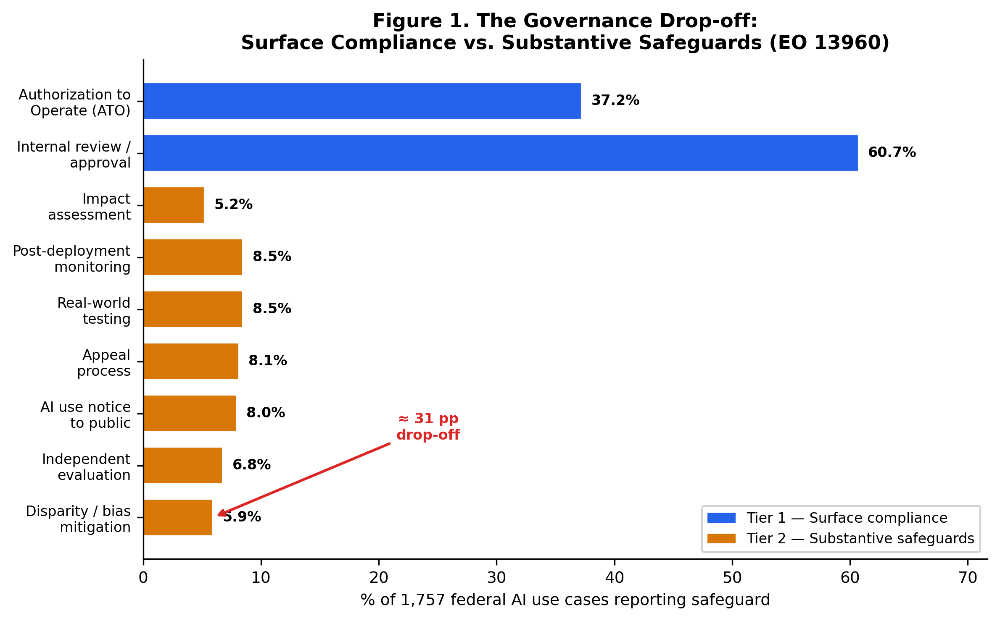
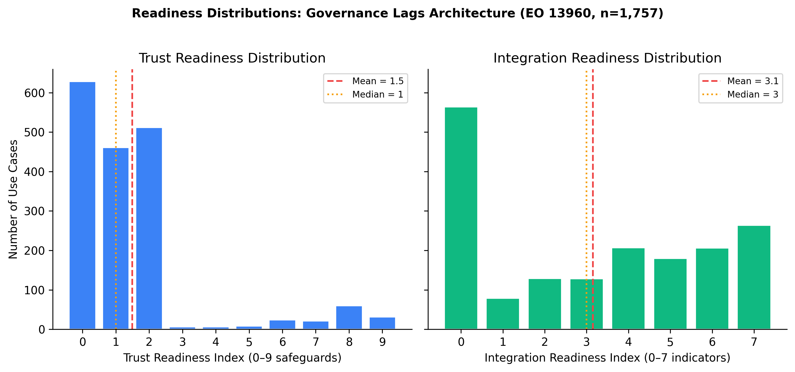
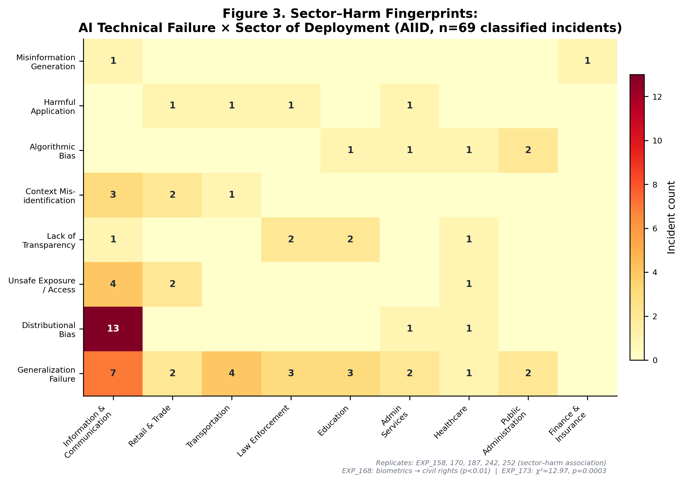
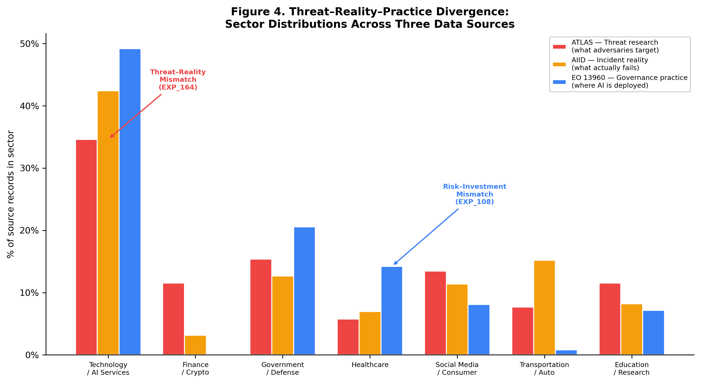
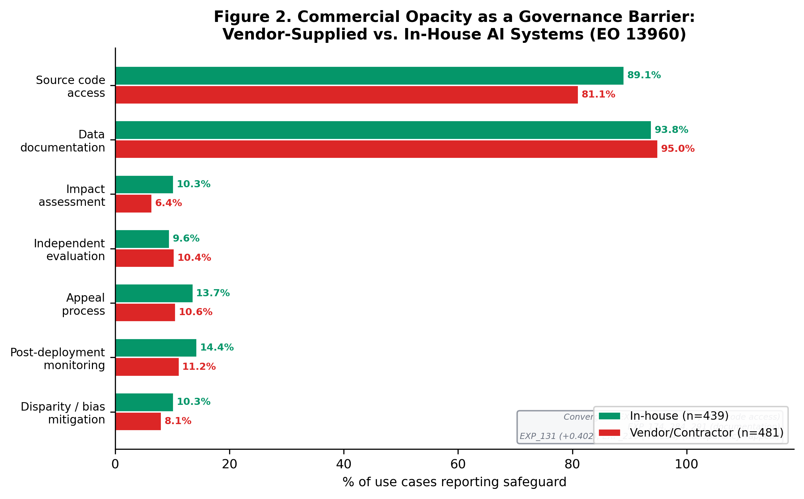
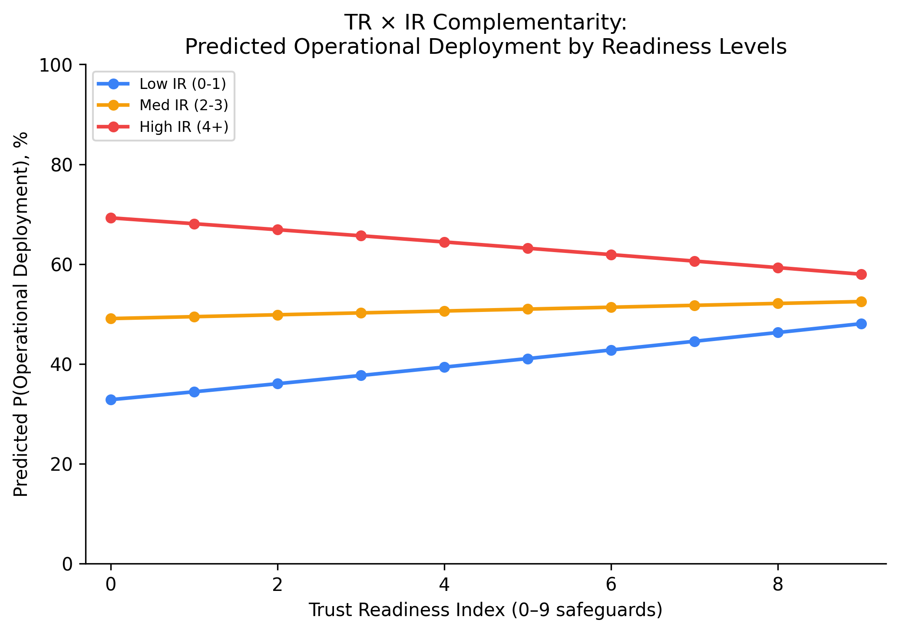

# Governance Readiness Gaps in Organizational AI Deployment: A Triangulated Analysis of Threats, Incidents, and Practice

## Abstract

Organizations are scaling artificial intelligence (AI) with unprecedented ambition, yet most struggle to convert strategic intent into production-level value. Drawing on dynamic managerial capabilities theory and governance-as-capability perspectives, we investigate how *trust readiness* (governance capability) and *integration readiness* (architecture capability) shape the link between organizational AI orientation and realized AI value. We triangulate three publicly available secondary data sources — the MITRE ATLAS adversarial threat matrix (52 case studies), the AI Incident Database (1,362 incidents), and the U.S. Executive Order 13960 Federal AI Use Case Inventory (1,757 use cases across 38 agencies) — through a cross-taxonomy mapping anchored to McKinsey's empirically derived constraints to AI scaling. Our analysis reveals a striking governance gap: while 61% of federal AI deployments report internal review approval, only 37% hold formal authorization-to-operate, and fewer than 9% report substantive safeguards such as impact assessments, bias mitigation, or independent evaluation. A use-case-level logistic regression (n=1,757) shows that integration readiness is the dominant predictor of operational deployment (OR=1.40, p<0.001), whereas trust readiness shows no independent effect — and the TR × IR interaction is marginally negative, suggesting that governance and architecture are currently decoupled rather than complementary. We develop six theoretically grounded propositions linking CIO centrality, trust–integration complementarity (revised to a conditional maturity-threshold prediction), governance theater under regulatory pressure, commercial opacity, sector-calibrated governance, and transparency-without-agency to AI value realization. The findings contribute to IS research by (1) identifying and characterizing governance readiness gaps through a trust readiness / integration readiness lens, (2) providing triangulated empirical evidence from threat, incident, and practice data, and (3) offering a preliminary pathway test showing that architectural infrastructure — not governance — is the binding constraint on current AI deployment. Implications for CIOs and boards center on the insufficiency of compliance-oriented governance and the need for architectural co-investment to realize strategic AI ambitions.

**Keywords:** AI governance, governance readiness gaps, trust readiness, integration readiness, MITRE ATLAS, AI Incident Database, secondary data analysis

---

## Introduction

Artificial intelligence has moved from boardroom aspiration to organizational imperative. McKinsey's 2026 survey of global CIOs finds that 92% of organizations are actively deploying generative AI, yet only 1% report full-scale deployment across business functions (McKinsey, 2026). The gap between AI ambition and AI realization is widening, not narrowing. BCG (2025) reports that over 50% of firms cite legacy IT architectures as the primary barrier to AI scaling, while 74% of AI-leading companies — but far fewer laggards — continuously monitor responsible AI (RAI) framework compliance. Deloitte's Tech Trends 2026 argues that agentic AI value comes not from model selection alone but from redesigning operations and building agent-compatible architectures.

These practitioner findings converge on a fundamental tension that IS scholarship has only begun to address: *strategic AI orientation* — the degree to which a firm's leadership commits to AI as a strategic direction — is necessary but insufficient for AI value creation. Realization depends on enabling capabilities that span both governance and architecture.

We frame this tension through the lens of the CIO's evolving role. Upper echelons theory (Hambrick & Mason, 1984) establishes that executive cognition and attention shape strategic choices. Recent IS research extends this to AI contexts, showing that CIO centrality and board AI awareness significantly influence a firm's AI orientation (MISQ, 2021). Yet orientation alone does not produce outcomes. Drawing on the dynamic managerial capabilities framework (Adner & Helfat, 2003; Hossain et al., 2025), we argue that organizations require two distinct capability bundles to convert orientation into value:

1. **Trust readiness** — the governance capability bundle encompassing risk management, compliance, adversarial threat modeling, incident response, and stakeholder accountability. This is grounded in normative frameworks including NIST AI RMF 1.0 (NIST, 2023), the EU AI Act (Regulation 2024/1689), OWASP Top 10 for LLM Applications (OWASP, 2025), and the MITRE ATLAS adversarial threat taxonomy.

2. **Integration readiness** — the architecture capability bundle encompassing agentic design patterns, orchestration controls, data pipeline governance, GenAIOps lifecycle management, and modular deployment infrastructure. This is grounded in practitioner guidance from Microsoft Azure Well-Architected AI, Google Cloud agentic design patterns, and GenAIOps/LLMOps practices.

The central claim of this paper is that these two readiness bundles *should* be strategic complements: weak architecture undermines governance effectiveness (policies without enforcement hooks are unverifiable), and weak governance constrains safe architecture deployment (orchestration without access boundaries creates excessive agency risk). Their joint presence should enable the conversion of AI orientation into realized value — but whether this complementarity holds in current practice is an empirical question.

To ground this argument empirically, we triangulate three publicly available secondary data sources that have not previously been connected in IS research:

- **MITRE ATLAS** (Adversarial Threat Landscape for AI Systems): 52 adversarial case studies, 16 tactics, 155 techniques, and 35 mitigations representing what *can* go wrong with AI systems.
- **AI Incident Database (AIID)**: 1,362 documented incidents and 6,681 media reports representing what *has* gone wrong in real-world AI deployments.
- **EO 13960 Federal AI Use Case Inventory**: 1,757 government AI deployments across 38 agencies with 62 governance and integration variables, representing what organizations *are actually doing*.

By mapping these three sources through a cross-taxonomy bridging table anchored to McKinsey's empirically derived "constraints to AI scaling" (8 barriers reported by CIOs, ranging from talent gaps at 31% to change management resistance at 16%), we construct a triangulated evidence base that links threat landscapes, incident patterns, and governance practice gaps to identify where organizational readiness is weakest.

Our analysis reveals a governance gap that is both striking and consequential. In the EO 13960 inventory, 60.7% of AI use cases report internal review approval and 37.2% report holding an Authorization to Operate (ATO) — suggesting that even basic surface-level compliance is far from universal. When we examine substantive governance safeguards — impact assessments, post-deployment monitoring, bias mitigation, independent evaluation — completion rates plummet to 5.2–8.5%. Even among the 227 use cases explicitly flagged as impacting rights or safety, where deep governance is mandatory by executive order, only 16–23% report these safeguards. This 61%→6% compliance drop-off provides empirical evidence of a *governance theater* phenomenon: organizations satisfy review processes while largely foregoing the substantive governance work that frameworks like NIST AI RMF, the EU AI Act, and MITRE ATLAS require.

This paper makes three contributions. First, we *conceptualize* trust readiness and integration readiness as distinct capability bundles grounded in normative standards and practitioner guidance, providing a theoretical lens for diagnosing governance gaps. Second, we provide *triangulated empirical grounding* from threat, incident, and practice data — connecting what can go wrong, what has gone wrong, and what organizations are doing about it — supplemented by a use-case-level logistic regression (n=1,757) that provides a preliminary test of the Orientation → TR × IR → Value pathway. Third, we offer a *replicable analytical framework* (cross-taxonomy mapping methodology, analysis-ready datasets, and reproducible scripts) that other researchers can extend, audit, and build upon. We develop six propositions linking CIO centrality, trust–integration complementarity (revised to a conditional maturity-threshold prediction based on our empirical findings), governance theater under regulatory pressure, commercial opacity, sector-calibrated governance, and transparency-without-agency to AI value realization.

The remainder of this paper is organized as follows. We review related work on AI governance, capability-based perspectives, and the CIO's role in shaping AI orientation. We then describe our methodology in detail, emphasizing reproducibility. We present findings from the governance gap analysis and cross-source triangulation. We develop propositions grounded in the triangulated evidence. We conclude with implications for research and practice.

---

## Theoretical Background

### CIO Role and AI Orientation

Upper echelons theory posits that organizational outcomes are partially predicted by the characteristics, experiences, and attention patterns of top management team members (Hambrick & Mason, 1984). The CIO's role has evolved from a technology steward to a strategic partner (Springer, 2023), with digital transformation requiring CIOs to operate simultaneously across technical, business, and institutional domains. In AI contexts, this multidimensionality becomes critical: AI orientation — a firm's strategic commitment to AI as a source of competitive advantage — is shaped by CIO centrality (board access, reporting structure, agenda ownership) and board AI awareness (MISQ, 2021).

McKinsey (2026) frames the contemporary CIO mandate around three imperatives: strategy, speed, and scaled intelligence. BCG (2025) provides empirical backing: at 86% of AI-leading companies, IT leads or co-leads generative AI initiatives, compared to only 54% at AI-stagnating firms. Gartner (2026) identifies agility and risk mastery as the defining items on the CIO agenda, both requiring strategic-level AI orientation. These converging practitioner findings support the theoretical claim that CIO centrality is a necessary antecedent of organizational AI orientation.

### Dynamic Managerial Capabilities and Governance-as-Capability

While upper echelons theory explains *why* CIO attention matters for AI orientation, it does not explain *how* orientation converts into realized value. For this, we draw on the dynamic managerial capabilities (DMC) framework (Adner & Helfat, 2003), which identifies managerial human capital, managerial social capital, and managerial cognition as the micro-foundations of capability building. Hossain et al. (2025) extend DMC to digital leadership contexts, arguing that digital-era executives must develop capabilities that span both technical and institutional domains.

We complement DMC with a governance-as-capability perspective. Rather than treating governance as a static compliance constraint, we conceptualize it as a dynamic organizational capability — a bundle of routines, skills, and processes that enables the firm to sense governance requirements, seize governance opportunities (e.g., building trust as competitive advantage), and reconfigure governance structures as regulatory and technological landscapes evolve (Teece, 2007). This framing aligns with ISACA's COBIT for AI (2024), which defines governance not as overhead but as a set of objectives that organizations must actively build competency in.

### Trust Readiness

Trust readiness is the governance capability bundle that enables an organization to deploy AI systems that are secure, compliant, accountable, and trustworthy. We conceptualize trust readiness through four domains derived from normative standards:

- **Risk governance and lifecycle management** (NIST AI RMF GOVERN/MAP/MEASURE/MANAGE functions)
- **Adversarial threat modeling and mitigation** (MITRE ATLAS tactics, techniques, and mitigations)
- **Vulnerability management** (OWASP Top 10 for LLM Applications)
- **Regulatory compliance** (EU AI Act Art. 9–15, ISO/IEC 42001, ISO/IEC 23894)

Trust readiness is not binary. The EO 13960 data reveal a continuum from basic compliance (ATO authorization) through intermediate controls (impact assessment) to advanced governance (independent evaluation, bias mitigation). Our analysis quantifies where organizations fall on this continuum and where the most significant gaps lie.

### Integration Readiness

Integration readiness is the architecture capability bundle that enables an organization to deploy AI systems that are scalable, reusable, interoperable, and operationally sustainable. We conceptualize integration readiness through domains derived from practitioner guidance:

- **Agentic orchestration patterns** (single-agent, multi-agent, human-in-the-loop)
- **Tool-use boundaries and access controls** (agent-to-tool authorization)
- **Nondeterminism management** (evaluation frameworks, output validation)
- **GenAIOps / LLMOps lifecycle governance** (CI/CD for AI, model versioning, drift monitoring)
- **Data pipeline and RAG architecture** (retrieval-augmented generation, embedding management)
- **Modular, composable AI infrastructure** (API-first design, service mesh, observability)

BCG (2025) finds that over 50% of firms identify legacy IT architecture as the primary barrier to AI scaling, underscoring the strategic importance of integration readiness as a capability rather than a fixed asset.

### Complementarity of Trust and Integration Readiness

We theorize that trust readiness and integration readiness are strategic complements (Milgrom & Roberts, 1990): the marginal value of each capability bundle increases when the other is also present. This complementarity arises because:

1. Governance controls require architectural hooks to be *enforceable* — audit logging requires telemetry infrastructure, human override requires architectural approval gates, and model risk assessment requires evaluation pipelines.
2. Architectural patterns require governance boundaries to be *safe* — multi-agent orchestration without access governance creates excessive agency risk (OWASP LLM06); RAG without data governance creates embedding vulnerabilities (OWASP LLM08).

NIST AI RMF explicitly treats GOVERN, MAP, MEASURE, and MANAGE as interdependent functions: governance without measurement infrastructure is unverifiable, and measurement without governance is ungoverned. MITRE ATLAS case studies confirm that incidents typically involve failures across both domains simultaneously.

---

## Methodology

This study employs a secondary-data triangulation approach using three publicly available data sources. The methodology is designed to be fully replicable: all data sources are publicly accessible, all analysis scripts are version-controlled and published in the companion repository, and all intermediate outputs are preserved for audit.

### Research Design

We follow a *convergent triangulation* design (Creswell & Plano Clark, 2018) adapted for secondary data. Three data streams are independently collected, profiled, and coded, then merged through a cross-taxonomy mapping that bridges their distinct classification schemes. The triangulation logic connects:

- **Threat data** (MITRE ATLAS) — what adversarial attacks *can* exploit in AI systems
- **Incident data** (AIID) — what harms *have* occurred in deployed AI systems
- **Practice data** (EO 13960) — what governance and integration controls organizations *actually report*

By connecting these three perspectives, we can identify governance readiness gaps — where reported practice lags behind what threat reality and incident evidence demand.

### Data Sources

Table 1 summarizes the three data sources.

| Source | Records | Variables | Licence | Snapshot Date |
|--------|--------:|----------:|---------|---------------|
| MITRE ATLAS v4.x | 52 case studies; 16 tactics; 155 techniques; 35 mitigations | Tactic, technique, procedure, mitigation, case narrative | Apache 2.0 | Feb 2026 |
| AI Incident Database (AIID) | 1,362 incidents; 6,681 reports | Incident ID, title, date, description, CSET taxonomy (214 classified), GMF taxonomy (326 classified) | CC BY-SA 4.0 | Feb 2026 |
| EO 13960 Federal AI Use Case Inventory | 1,757 use cases | 62 variables incl. agency, dev stage, purpose, PII handling, ATO status, 12+ safeguard indicators | Public domain | 2024 consolidated |

**MITRE ATLAS** is the Adversarial Threat Landscape for AI Systems, maintained by the MITRE Corporation. It provides a structured taxonomy of adversarial tactics, techniques, and procedures (TTPs) targeting machine learning systems, modeled after the MITRE ATT&CK framework for cybersecurity. Each case study documents a real or demonstrated adversarial scenario, the attack chain (sequence of tactics and techniques), and applicable mitigations. We use the open-source ATLAS data repository (https://github.com/mitre-atlas/atlas-data), which provides machine-readable YAML files for tactics, techniques, mitigations, and case studies.

**AI Incident Database (AIID)** is a systematically curated repository of real-world AI incidents, maintained by the Responsible AI Collaborative. Each incident aggregates one or more media reports and may include structured classifications from two expert taxonomies: the Center for Security and Emerging Technology (CSET) taxonomy, which classifies 214 incidents by AI technique, harm type, and sector; and the Goals, Methods, and Failures (GMF) taxonomy, which classifies 326 incidents by known technical failures, near-miss status, and potential failure categories. We use the full MongoDB snapshot (https://incidentdatabase.ai/research/snapshots/).

**EO 13960 Federal AI Use Case Inventory** is a government-mandated inventory of all AI use cases across U.S. federal agencies, created under Executive Order 13960 (December 2020) and consolidated in the 2024 release. Each use case record includes 62 variables covering agency, system name, development stage, purpose description, AI techniques used, PII handling, infrastructure, review status, and a comprehensive set of governance safeguard indicators (impact assessment, risk identification, monitoring, bias mitigation, stakeholder consultation, appeal processes, etc.). We use the consolidated CSV from the Office of Management and Budget (https://github.com/ombegov/2024-Federal-AI-Use-Case-Inventory).

### Data Profiling and Quality Assessment

Before analysis, we profile each data source to assess completeness, coverage, and quality (`scripts/00_profile_sources.py`, `scripts/04_profile_eo13960.py`). Key profiling steps include:

- **ATLAS**: Count of tactics, techniques, mitigations, and case studies; distribution of case studies across tactics; identification of most-referenced mitigations.
- **AIID**: Count of incidents, reports, and classified incidents per taxonomy; distribution of harm types and sectors; assessment of CSET and GMF coverage overlap.
- **EO 13960**: Completeness analysis across all 62 variables; identification of Tier-1 (basic) vs. Tier-2 (deep) governance safeguards; subsetting of rights-and-safety-impacting use cases (n=227); distribution across agencies and development stages.

### Cross-Taxonomy Mapping

The three data sources use distinct classification schemes that do not share a common ontology. To enable triangulation, we construct a *cross-taxonomy bridging table* that maps elements from each source to a common set of organizing constructs (`scripts/01_cross_taxonomy_mapping.py`).

We anchor the bridging table to McKinsey's empirically derived "constraints to AI scaling" (McKinsey, 2026, Exhibit 5), which reports eight barriers cited by CIOs in a global survey:

| ID | Constraint | CIOs Citing (%) |
|----|-----------|---:|
| C1 | Talent and capability gaps | 31 |
| C2 | Integration complexity | 29 |
| C3 | Security, reliability, and hallucinations | 26 |
| C4 | Regulatory, privacy, and compliance | 24 |
| C5 | Lack of modern data foundations | 21 |
| C6 | Lack of clear business use cases | 18 |
| C7 | Difficulty measuring ROI and value | 17 |
| C8 | Internal resistance and change management | 16 |

We chose these constraints as the organizing anchor because they (a) are empirically derived from CIO surveys, (b) span governance and integration concerns, (c) are practitioner-legible, and (d) provide a natural bridge to the trust readiness / integration readiness framing of our conceptual model. Importantly, the McKinsey constraints are not a standalone ontology; they map systematically onto the NIST AI RMF functions that structure our trust readiness construct. C3 (security/reliability) corresponds to MEASURE and MANAGE; C4 (regulatory/compliance) to GOVERN; C1 (talent) to MAP; and C2 (integration) to the cross-cutting infrastructure requirements that span all four NIST functions. We use McKinsey’s practitioner-facing labels for accessibility while maintaining this academic anchor to the normative framework underpinning the paper’s theoretical spine.

The mapping procedure proceeds as follows:

1. **ATLAS → Constraints**: Each ATLAS tactic (n=16) is mapped to one or more McKinsey constraints based on the nature of the adversarial threat. For example, *Reconnaissance* (AML.TA0002) maps to C1 (talent gap — insufficient red-teaming capability) and C3 (security); *Exfiltration* (AML.TA0010) maps to C4 (privacy/compliance); *Resource Development* (AML.TA0003) maps to C2 (integration — supply chain and resource acquisition failures).

2. **AIID → Constraints**: AIID incident categories from the CSET and GMF taxonomies are mapped to McKinsey constraints based on the type of harm or failure. For example, *bias/discrimination* incidents map to C4 (compliance) and C3 (reliability); *misinformation/hallucination* incidents map to C3; *privacy/surveillance* incidents map to C4.

3. **EO 13960 → Constraints**: EO 13960 governance safeguard variables are mapped to McKinsey constraints based on the governance function they represent. For example, *impact assessment* maps to C4 (regulatory compliance) and C7 (ROI measurement); *post-deployment monitoring* maps to C7 and C3 (reliability); *stakeholder consultation* maps to C8 (change management).

Each mapping link records the source element, target constraint, link type (threatens, addresses, evidences, or measures), and rationale. The resulting bridging table contains 126 links spanning all three sources and seven of the eight constraints (C6 — *lack of clear business use cases* — has no direct mapping from the threat, incident, or governance taxonomies used). All 126 links are *rule-based*: each mapping is hardcoded in the analysis script (`scripts/01_cross_taxonomy_mapping.py`) with an explicit assignment rationale, rather than produced by machine-learning classification or subjective coding at scale. This design choice maximizes transparency and auditability: every mapping decision can be inspected, challenged, and revised by reviewers.

Table 1b illustrates the mapping logic with one representative link from each source and link type.

**Table 1b.** Cross-taxonomy mapping examples (one per source)

| Source | Source Element | Constraint | Link Type | Rationale |
|---|---|---|---|---|
| ATLAS | Exfiltration (AML.TA0010) | C4: Regulatory / privacy | threatens | Data exfiltration directly threatens privacy/compliance obligations |
| AIID‑GMF | Distributional Bias | C4: Regulatory / privacy | evidences | Bias incidents evidence compliance failures in fairness requirements |
| EO 13960 | 52_impact_assessment | C4: Regulatory / privacy | measures | Impact assessment measures readiness for regulatory compliance |
| ATLAS | AML.M0024 (Telemetry Logging) | C3: Security / reliability | addresses | Logging mitigates security threats by enabling detection and audit |

**Mapping validation.** Because a single researcher produced the mapping (no second coder for inter-rater reliability), we validate robustness through Monte Carlo sensitivity analysis (`scripts/11_mapping_sensitivity.py`). Across 1,000 iterations at each of three perturbation rates (10%, 15%, 20% of links randomly reassigned to different constraints), the mapping structure is highly stable: the top constraint (C3: security/reliability) is preserved in 100% of iterations at all perturbation rates; the top-2 set {C3, C4} is preserved in 99.9% of iterations even at 20% perturbation; the mean Spearman rank correlation between perturbed and baseline constraint distributions is ρ=0.95 (SD=0.05) at 20% perturbation; and all three source taxonomies retain coverage of both C3 and C4 in 93%+ of iterations. Critically, the paper’s core empirical findings — the governance drop-off (61% → 5–9%), procurement opacity, and IR > TR as deployment predictor — are computed directly from EO 13960 variables and are not mediated by the cross-taxonomy map. The map underpins the triangulation logic (§4.4), and the sensitivity analysis confirms that this triangulation structure is robust to substantial perturbation of mapping decisions.

### Analysis-Ready Dataset Preparation

We transform the raw cross-taxonomy map into four analysis-ready datasets (`scripts/02_prepare_datasets.py`):

1. **ATLAS cases enriched** (`atlas_cases_enriched.csv`): Each ATLAS case study is tagged with its associated tactics, techniques, and mitigations, then linked to McKinsey constraints via the bridging table.

2. **AIID incidents classified** (`aiid_incidents_classified.csv`): AIID incidents with CSET and/or GMF classifications are merged, and each incident is tagged with applicable McKinsey constraints based on its failure type and sector.

3. **EO 13960 scored** (`eo13960_scored.csv`): Each federal AI use case receives a governance readiness score computed from the ratio of reported safeguards to applicable safeguards, yielding a continuous 0–1 governance completeness index.

4. **Unified evidence base** (`unified_evidence_base.csv`): A long-format stacked dataset combining all three sources, with common fields for source, element, constraint, link type, and evidence strength indicators.

### Figure Generation

Publication-ready figures are generated programmatically (`scripts/03_generate_figures.py`) to ensure reproducibility. Five figures are produced:

1. **Governance gap bar chart**: Side-by-side comparison of Tier-1 (basic) vs. Tier-2 (deep) safeguard completion rates in the EO 13960 data.
2. **AIID failure–sector heatmap**: Cross-tabulation of the top 8 technical failure types by the top 8 deployment sectors, showing incident concentration patterns.
3. **ATLAS tactic frequency chart**: Distribution of adversarial cases across the 16 ATLAS tactics, highlighting which attack categories are most prevalent.
4. **Constraint coverage radar**: Coverage of each McKinsey constraint across the three data sources, showing triangulation breadth.
5. **Governance readiness distribution**: Histogram of the governance completeness index across all 1,757 EO 13960 use cases.

### Pathway Model: Orientation → TR × IR → Value

To move beyond descriptive governance gap analysis and provide preliminary evidence on the theorized Orientation → TR × IR → Value pathway, we construct proxy variables from EO 13960 fields and estimate a series of logistic regression models at the use-case level (n=1,757) (`scripts/09_pathway_model.py`).

**Orientation proxy (agency-level, assigned to each use case).** We combine two indicators: (a) log-transformed portfolio size (number of AI use cases per agency), capturing resource commitment, and (b) topic area breadth (number of distinct AI domains per agency), capturing strategic scope. Both are z-standardized and averaged into a composite orientation index.

**Trust Readiness (TR) index (use-case level, 0–9).** A count of nine governance safeguard indicators: ATO, internal review, impact assessment, real-world testing, independent evaluation, post-deployment monitoring, AI notice, disparity mitigation, and appeal process. Each indicator is coded 1 if the response indicates affirmative implementation (not blank, "no," or "n/a").

**Integration Readiness (IR) index (use-case level, 0–7).** A count of seven architecture and infrastructure indicators drawn from EO 13960 fields that capture whether the organizational and technical conditions for deploying and sustaining an AI system are in place. Table 2a maps each indicator to its EO source column and coding rule.

**Table 2a.** Integration Readiness index components

| IR Indicator | EO 13960 Column | Coding |
|---|---|---|
| Data catalog available | 31_data_catalog | "Yes…" = 1 |
| Data documentation | 34_data_docs | Non-blank, non-"No/N/A" = 1 |
| Custom code present | 37_custom_code | "Yes…" = 1 |
| Source-code access | 38_code_access | Non-blank, non-"No/N/A" = 1 |
| Infrastructure provisioned | 43_infra_provisioned | "Yes…" = 1 |
| Timely resource access | 47_timely_resources | "Yes…" = 1 |
| Code / data reuse from prior projects | 49_existing_reuse | Non-"None", non-blank = 1 |

Item-level prevalence ranges from 34% (reuse) to 62% (data documentation), substantially higher than deep TR safeguards (5–9%). This asymmetry — architecture indicators nearly an order of magnitude more prevalent than substantive governance safeguards — foreshadows the readiness gap documented in Findings.

**Outcome: operational deployment (use-case level, binary).** Coded 1 if the development stage is "Operation and Maintenance," "Implementation and Assessment," "In production," or "In mission" — i.e., the system has progressed beyond planning and development to actual deployment.

**Controls.** Development method (vendor-only vs. in-house vs. mixed), and rights/safety impact classification.

We estimate four nested models: (M1) controls only; (M2) + orientation; (M3) + TR + IR main effects; (M4) + TR × IR interaction. We report odds ratios and 95% confidence intervals. As a supplementary check, we also estimate an agency-level OLS model (n=38) with the share of operational deployments as the dependent variable.

### Reproducibility

All analysis code, data paths, and intermediate outputs are organized in a public GitHub repository (https://github.com/carlosdenner/amcis-2026-strategic-ai-orientation.git). The repository follows a separation-of-concerns structure:

```
data/raw/         ← Immutable source data (not edited after acquisition)
data/processed/   ← Regenerable analysis outputs
scripts/          ← Numbered pipeline scripts (00–04)
paper/figures/    ← Publication-ready PNGs (regenerated by scripts/03)
```

To reproduce all results from raw data:

```bash
python scripts/01_cross_taxonomy_mapping.py   # → cross_taxonomy_map.csv
python scripts/02_prepare_datasets.py         # → 4 analysis CSVs
python scripts/03_generate_figures.py         # → 5 publication PNGs
python scripts/09_pathway_model.py            # → pathway_model_data.csv + regression output
python scripts/10_ir_analysis.py              # → fig6_tr_ir_distributions.png + IR stats
python scripts/11_mapping_sensitivity.py      # → mapping robustness check (console output)
```

Dependencies are specified in `requirements.txt` (pandas, PyYAML, matplotlib, numpy, statsmodels). No API keys are required for the core analysis pipeline; the optional LLM-based enrichment pipeline (`scripts/agents/`) requires an OpenAI API key but is not needed to reproduce the reported findings.

---

## Findings

Our findings synthesize convergent patterns from 400 exploratory AutoDiscovery experiments (Session 1: 100; Session 2: 300) across the three-source evidence base. Importantly, the high contradiction rate is not treated as "failed analysis" but as substantive evidence: many hypotheses encoded implicit assumptions of contemporary AI governance frameworks (e.g., risk-tiering works; maturity increases safeguards; transparency implies agency). The systematic falsification of these assumptions — 67.7% contradicted across all experiments — constitutes a central empirical signal of governance readiness gaps rather than a methodological weakness.

### 4.1 The Governance Gap: Surface Compliance vs. Substantive Safeguards

**Finding:** Federal AI deployments exhibit high surface compliance but extremely low substantive safeguards, producing a steep "compliance drop-off" that remains largely flat even when systems are classified as higher impact or rights-impacting.

Across 1,757 EO 13960 AI use cases, internal review/approval is reported by 60.7% of systems (1,067 of 1,757), but even the more basic Authorization to Operate (ATO) appears in only 37.2% (654 of 1,757) — indicating that surface-level compliance is far from universal. When we examine the safeguards most directly aligned with modern trustworthy AI frameworks — impact assessments, post-deployment monitoring, independent evaluation, and disparity/bias mitigation — implementation rates collapse further to single digits. Impact assessments are reported by 5.2% (92 of 1,757); the weakest safeguard is disparity/bias mitigation at 5.9% (104 of 1,757). The approximately 55 percentage-point drop from internal review to the substantive safeguard floor is striking. In practical terms, the inventory describes an environment where review processes exist, but the operational work required to detect, prevent, and remediate harmful AI outcomes is rare.

Table 2b summarizes this pattern as a Tier-1 vs. Tier-2 split.

**Table 2b.** EO 13960 safeguard completion rates (surface compliance vs. deep safeguards)

| Safeguard Category | Indicator | Count | % of 1,757 |
|---|---|---:|---:|
| Tier 1 (surface compliance) | Internal review / approval | 1,067 | 60.7% |
| | Authorization to Operate (ATO) | 654 | 37.2% |
| Tier 2 (substantive safeguards) | Post-deployment monitoring | 149 | 8.5% |
| | Real-world testing | 149 | 8.5% |
| | Appeal process | 143 | 8.1% |
| | AI use notice to public | 140 | 8.0% |
| | Independent evaluation | 119 | 6.8% |
| | Disparity / bias mitigation | 104 | 5.9% |
| | Impact assessment | 92 | 5.2% |



This "surface-to-substance" drop-off is not simply a baseline artifact; it persists even where governance is expected to intensify. Among the 227 EO use cases explicitly flagged as rights- or safety-impacting, deep safeguards rise but remain limited: impact assessment (22.5%), independent evaluation (18.1%), and bias/disparity mitigation (16.3%). The mandatory subset therefore illustrates attenuation rather than elimination of the gap: requirements increase nominally, but implementation remains far from universal.

The strongest experimental signal reinforcing this interpretation is the failure of risk-tiering. Multiple experiments tested the proposition that higher-impact systems would report stronger governance controls. They did not. For example, high-impact systems were not more likely to report independent evaluation (EXP_146, n=1,718, p<0.0001; contradicted), and rights-impacting systems were not more likely to report impact assessment (EXP_207, n=1,757; contradicted). Variations of this risk-tiering hypothesis repeated with the same outcome (e.g., EXP_230, n=1,718; contradicted; EXP_256; contradicted). Two experiments provide mild boundary nuance (high-stakes subset and safety-critical agency comparisons), but these appear as marginal exceptions rather than a functioning tiering regime (EXP_282, n=367; +0.172; EXP_290; +0.191). The dominant empirical implication is that "risk-based governance" operates primarily as a framework principle rather than an implemented organizational routine.

Finally, we observe that policy mandates alone do not produce detectable shifts in the most consequential safeguards. Three experiments tested pre/post timing around EO 13960-era governance expectations and found no measurable increase in bias/disparity mitigation (EXP_182, −0.536; EXP_241, −0.587; EXP_268, −0.542). These negative belief shifts strengthen the interpretation that governance activity is shaped less by formal mandates than by implementability constraints (e.g., data availability, evaluation infrastructure, procurement transparency).

Taken together, Section 4.1 establishes the paper's core empirical anchor: the EO inventory records internal review processes without commensurate evidence of "capacity to govern," consistent with a governance theater dynamic where organizations can report compliance-adjacent controls without reporting the substantive safeguards required to manage real AI harms.

### 4.2 Integration Readiness: Architecture Outpaces Governance

**Finding:** Integration readiness is substantially more developed than trust readiness across the federal AI portfolio, with a bimodal distribution suggesting that systems are either architecturally well-equipped or almost entirely unprovisioned.

Figure 6 contrasts the distributions. The TR index (0–9) concentrates at the low end: 36% of use cases score 0 (no safeguards at all) and 91% score 0–2 (median=1, IQR=0–2, mean=1.49). In contrast, the IR index (0–7) spreads across the full range: while 32% score 0, another 37% score 5–7 (median=3, IQR=0–6, mean=3.15). This bimodal IR pattern — a large cluster of unprovisioned systems plus a large cluster of well-provisioned ones — is consistent with an organizational capability interpretation: agencies that build architectural infrastructure tend to provision multiple indicators at once, while those that do not provision any.



Operational deployment rates differ sharply by IR level: 33% for low-IR systems (0–2, n=772), 57% for mid-IR (3–4, n=335), and 73% for high-IR (5–7, n=650). The near-doubling from low to high IR is consistent with the logistic regression finding (§4.7) that IR is the dominant predictor of deployment.

Critically, IR and governance safeguards are not independent. Systems with higher architectural readiness are significantly more likely to exhibit *bundled* deep safeguards — two or more of impact assessment, independent evaluation, bias mitigation, post-deployment monitoring, or real-world testing. Among low-IR systems, only 1.6% show bundled safeguards; among high-IR systems, 14.9% do (χ²=87.3, p<0.001). The Spearman correlation between IR and deep TR is ρ=0.228 (p<0.001). This suggests that architectural infrastructure is a necessary (though not sufficient) precondition for substantive governance: organizations that lack data catalogs, provisioned infrastructure, and code access are also unlikely to perform impact assessments or bias mitigation. In capability terms, governance safeguards require architectural *hooks* — and those hooks are what the IR index measures.

This finding directly supports the complementarity thesis at a descriptive level, even though the regression interaction (§4.7) is not yet positive: the preconditions for complementarity (co-occurrence of IR and deep TR) exist in the high-IR tail of the distribution, but they are too rare at current maturity levels to produce a detectable interaction in the full sample. The Session 1 structural finding that trust and integration failures are intertwined in incident contexts (mixed clusters; EXP_055) provides convergent support: when adversarial cases and incidents are examined, the failure modes that produce real harm typically span both governance and architectural domains simultaneously, implying that the two readiness bundles are functionally coupled even when organizationally siloed.

### 4.3 Threat Landscape: Sector-Specific Harm Fingerprints

**Finding:** AI harms are sector-structured and modality-sensitive rather than autonomy-driven; generative AI is reshaping incident volume, while physical-world AI remains disproportionately severe per incident.

Across AIID incidents, harm patterns are not evenly distributed. Instead, multiple experiments converged on sector-specific harm fingerprints: finance incidents skew toward economic harm, healthcare incidents toward physical harm, and government/public sector incidents toward civil rights and social harm. This pattern replicates across different operationalizations and samples (e.g., keyword classification, filtered incident subsets): EXP_158, EXP_170, EXP_187, EXP_242, and EXP_252 all support the sector–harm association at statistical significance, providing a stable descriptive backbone for the "threat → harm" portion of our triangulation logic.

Within these fingerprints, more granular modalities matter. Biometrics incidents show a disproportionate association with civil rights harm (EXP_168, p<0.01). At the technical-failure level, fairness failures map more strongly to intangible harms, while safety failures map to tangible harms; this relationship is one of the most statistically robust results in the AIID analyses (EXP_173: χ²=12.97, p=0.0003). These patterns suggest that "trust readiness" should be understood as a configurable capability bundle whose emphasis (e.g., fairness evaluation vs. safety assurance vs. privacy controls) must be calibrated to sector and modality rather than uniformly applied.

The incident landscape is also evolving temporally. Two experiments confirm a post-2022 generative AI incident expansion, with GenAI incidents increasing sharply in relative share compared to earlier periods (EXP_177; EXP_183). However, this shift in volume does not eliminate a parallel governance problem: physical-world AI systems (robotics and autonomous vehicles) remain more severe per incident than GenAI systems (EXP_271). The implication is not that GenAI is "less risky," but that the governance challenge bifurcates into (a) high-frequency, often intangible-harm GenAI failures (misinformation, reputational harm, discrimination), and (b) lower-frequency but higher-severity physical safety failures in embodied systems.

A particularly important set of contradictions concerns autonomy. Across 15 experiments, the intuitive hypothesis "higher autonomy → more physical harm" was repeatedly contradicted or null, indicating that autonomy level does not reliably predict harm type (EXP_139, 140, 152, 193, 212, 217, 218, 223, 238, 250, 255, 264, 267, 277, 283, 300; summarized in Session 2). Only one experiment found a weak positive relationship between autonomy and severity (not physical harm specifically) (EXP_248). These contradictions are theoretically meaningful: they caution against governance designs that treat autonomy as the primary risk stratifier while ignoring sector and modality effects that show stronger empirical signal.



Finally, cross-source comparison suggests that malice and harm are not coupled in the intuitive way. When adversarial ATLAS cases are compared to AIID incidents, adversarial attacks are associated more with intangible harms, while accidental failures are associated more with physical harms (EXP_156, +0.153). This matters for capability investment: organizations that prioritize adversarial defense as the primary safety strategy may underinvest in the engineering assurance and operational monitoring practices that prevent accidental physical failures.

### 4.4 Cross-Source Triangulation: Where Threats, Incidents, and Governance Diverge

**Finding:** Threat research focus (ATLAS), real-world incident concentration (AIID), and governance investment patterns (EO 13960) do not align, producing a triangulated "threat–reality–practice" divergence that helps explain persistent readiness gaps.

The conceptual value of triangulation is that it distinguishes three different "realities" of organizational AI risk: what adversaries can do (ATLAS), what harms occur in practice (AIID), and what controls organizations report deploying (EO). Our cross-source experiments suggest these realities do not naturally converge.

First, we observe a Threat–Reality Mismatch: ATLAS sector emphases (as represented in the ATLAS case corpus) differ from AIID incident sector distributions (EXP_164; confirmed). While ATLAS is a high-quality adversarial taxonomy, its case study concentration reflects the availability of published adversarial demonstrations and security research attention, which may systematically diverge from the sectors where failures are most frequently reported in the incident record. This mismatch is not a critique of ATLAS; it is an empirical warning that governance programs derived primarily from adversarial research may misallocate attention relative to incident reality.

Second, we observe a Risk–Investment Mismatch in the federal inventory: the sectors where government AI is deployed (EO) do not mirror the sectors where incidents concentrate (AIID) (EXP_108; surprise +0.171). This divergence matters because it implies that the governance posture of a deployment portfolio is not "incident-responsive" in a straightforward way; deployment decisions and harm distributions are shaped by different institutional and operational drivers.

Third, attempts to link incident concentration to improved governance yield additional contradictions that, collectively, strengthen the governance-gap interpretation. For example, one might expect high-incident sectors to show stronger governance (either because of learning, heightened scrutiny, or risk salience). Instead, an experiment testing sector incident intensity against governance outcomes produced a negative surprise signal (EXP_215; −0.399; contradicted). A plausible explanation is not that sector learning never occurs, but that EO-reported deep safeguards are near-zero across the board, making differential adaptation difficult to detect — consistent with Section 4.1's "flat" risk-tiering results.



The triangulation results therefore motivate a shift in explanatory focus: rather than assuming misalignment is driven solely by awareness deficits ("leaders don't know the risks"), the evidence points toward implementability constraints (e.g., procurement opacity, lack of evaluation infrastructure, absence of routinized governance bundles) that prevent threat/incident signals from translating into safeguard investment. This interpretation becomes especially salient when we consider the procurement findings below.

### 4.5 Structural Barriers: Commercial Opacity and Procurement Governance

**Finding:** Commercial procurement is the strongest and most consistently supported predictor of governance under-implementation, operating as a structural "opacity barrier" that blocks transparency prerequisites and cascades into weaker accountability safeguards.

Across Session 2, commercial opacity emerged as the single most robust, convergent result: 14 experiments independently converged on the pattern that vendor-supplied or commercially procured AI systems are associated with lower transparency and weaker downstream governance mechanisms. These results are notable because they identify not merely a "low governance" problem, but a structural barrier: governance safeguards that require technical visibility (code access, data documentation, independent evaluation) are difficult to implement when the system boundary is controlled by external vendors.

The evidence is consistent across multiple operational proxies. Vendor/contractor procurement predicts significantly lower reported code access (EXP_237; confirmed, EXP_245; confirmed, EXP_247; confirmed, EXP_293; confirmed) and lower reported data documentation (EXP_174; +0.185, EXP_284; +0.198, EXP_291; +0.191). The pattern is strongest for code access (vendor 81.1% vs. in-house 89.1%) and extends to most deeper safeguards: impact assessment (vendor 6.4% vs. in-house 10.3%), post-deployment monitoring (vendor 11.2% vs. in-house 14.4%), appeal process (vendor 10.6% vs. in-house 13.7%), and disparity mitigation (vendor 8.1% vs. in-house 10.3%). Two indicators — data documentation and independent evaluation — show negligible or reversed differences, suggesting that opacity effects are not uniform across all governance dimensions; vendors may provide standard documentation artifacts while remaining opaque to deeper auditability. Importantly, the transparency deficits are not isolated: they appear to cascade into accountability mechanisms. One experiment directly links code access (a transparency prerequisite) to the presence of an appeal process, producing a strong positive belief shift (EXP_131; surprise +0.402). A related experiment reinforces the pathway in the negative direction: where code access is absent, appeal processes are less likely (EXP_210; +0.204). Finally, combined transparency deficits replicate: vendor supply predicts lower likelihood of both code access and data documentation (EXP_299; confirmed).

This "opacity barrier" has two implications for how IS research should conceptualize AI governance readiness:

1. **Governance capability is bounded by architectural and contractual transparency.** Even highly motivated actors cannot implement independent evaluation or robust documentation when they lack the artifacts required for evaluation (model cards, training data lineage, code-level auditability). In capability terms, procurement opacity weakens the microfoundations of both trust readiness (auditability, accountability) and integration readiness (enforceable hooks for monitoring and access controls).

2. **Procurement governance becomes a first-class theoretical object, not a peripheral implementation detail.** The trust readiness construct explicitly includes third-party and supply-chain risk (TR-8), but the federal evidence suggests vendor opacity is not merely "a risk to manage" — it is a systemic constraint that shapes what governance is feasible.



In short, commercial procurement appears to function as a governance "black box" that prevents organizations from translating high-level governance commitments into implementable safeguards, helping explain why risk-tiering and policy mandates do not reliably predict safeguard adoption.

### 4.6 Governance Architecture: Bundling Effects and the Assessment-Action Gap

**Finding:** When governance is present, it appears as bundled capability clusters rather than isolated controls; however, assessments often do not translate into mitigation, and public-facing deployments exhibit transparency without agency.

While much of the EO inventory reflects low deep-safeguard prevalence, the safeguards that do appear are not independent. Instead, multiple experiments show bundling effects: controls co-occur in coherent clusters that resemble routinized governance capabilities rather than ad hoc checklist items.

Two bundles are especially salient. First, a verification and validation (V&V) bundle links assessment to testing and evaluation. Impact assessment predicts real-world testing with the strongest positive belief shift observed in the safeguard-mapping experiments (EXP_224; surprise +0.581), and real-world testing co-occurs with independent evaluation (EXP_261; +0.204). Second, an accountability bundle links assessment to communication and participation: impact assessment co-occurs with AI notice (EXP_167; +0.204) and with stakeholder consultation (EXP_206; +0.083), though stakeholder consultation has a very low base rate overall (the `63_stakeholder_consult` column elicits only 145 non-missing responses, many of which indicate "none of the above," placing true substantive consultation at approximately 3–4% of systems). ATO also appears to function as an upstream "gateway" in this maturity chain: it predicts other controls and, in particular, predicts impact assessment (EXP_066; +0.198; EXP_089; +0.172). Data governance shows a similar cascade structure (data catalog → data documentation; EXP_265; +0.120).

Bundling matters because it suggests a non-linear governance reality: agencies may be "all-in" or "all-out," with relatively few implementing partial bundles. This helps reconcile a key tension in the inventory: even if deep safeguards are rare overall, the few systems that implement them appear to do so in coherent combinations consistent with capability-building.

At the same time, bundling does not imply that governance is operationalized end-to-end. The most important decoupling is the assessment-action gap: impact assessments do not reliably translate into disparity/bias mitigation (EXP_175; confirmed prior). A related experiment suggests measurement/classification choices influence whether the linkage can be detected (EXP_213; neutral), but the overall pattern is consistent with governance theater: assessments may be produced as documentation artifacts without systematically triggering downstream mitigation work.

The second decoupling concerns public accountability. Public-facing systems show somewhat higher transparency signals (e.g., notice and appeal), but lower user agency — what Session 2 labels the Forced Participation Paradox. Public-facing deployments are more likely to provide an appeal process (EXP_160; +0.230) and AI notice (EXP_180; +0.211), but they are less likely to provide opt-out (EXP_134; +0.523). Contradictory variants (EXP_159; EXP_200) reinforce that these controls are not institutionalized consistently; rather, they appear contingent and uneven. The paradox is therefore not simply "public systems are worse," but more specific: public accountability is implemented as information provision rather than agency enablement.

The IR–safeguard bundling result from §4.2 provides additional quantitative grounding for the bundling interpretation: systems with higher integration readiness are significantly more likely to exhibit bundled deep governance (ρ=0.228, p<0.001). This suggests that the V&V and accountability bundles observed in this section do not arise in an architectural vacuum — they co-occur with provisioned infrastructure, documented data pipelines, and code access. The Session 1 structural finding that trust and integration failures are intertwined in incident contexts (mixed clusters; EXP_055) independently reinforces this pattern from the threat side: attacks and failures expose cross-domain fragility precisely because governance and architecture are functionally coupled.

Together, the results imply that governance readiness gaps are not limited to "missing policies" or "missing tools"; they reflect missing integrated routines — capability bundles that connect assessment, engineering controls, monitoring infrastructure, and accountability mechanisms into a closed loop.

### 4.7 Pathway Test: Architecture Drives Deployment, Governance Does Not (Yet)

**Finding:** Integration readiness is the dominant predictor of operational AI deployment; trust readiness shows no independent effect; the TR × IR interaction is marginally negative rather than positive, suggesting current substitution rather than theorized complementarity.

To move from descriptive governance gap analysis to a preliminary test of the Orientation → TR × IR → Value pathway, we estimate nested logistic regressions predicting operational deployment status (52.4% of use cases) from orientation, TR, IR, and their interaction, controlling for development method and impact classification.

Table 3 reports the results across four models.

**Table 3.** Logistic regression: predictors of operational deployment (n=1,757)

| Variable | M1 (Controls) | M2 (+Orient.) | M3 (+TR, IR) | M4 (+TR×IR) |
|---|---|---|---|---|
| Orientation | | −0.195*** | −0.273*** | −0.279*** |
| TR (0–9) | | | −0.054 | 0.085 |
| IR (0–7) | | | 0.316*** | 0.339*** |
| TR × IR | | | | −0.028† |
| Vendor | 1.109*** | 1.171*** | 0.813*** | 0.732*** |
| Mixed dev. | 0.955*** | 0.960*** | 0.436* | 0.367* |
| Rights/safety | 0.487** | 0.588*** | 0.928*** | 0.910*** |
| Pseudo R² | 0.055 | 0.059 | 0.147 | 0.148 |
| AIC | 2306.7 | 2297.6 | 2089.4 | 2087.7 |

*Note.* Coefficients are log-odds. †p<0.10, \*p<0.05, \*\*p<0.01, \*\*\*p<0.001.

Three findings emerge. First, **integration readiness is the strongest capability predictor**: each additional IR indicator increases the odds of operational deployment by approximately 40% (OR=1.40, 95% CI [1.33, 1.48], p<0.001). This effect is robust across all model specifications. In practical terms, use cases with established data catalogs, documented pipelines, provisioned infrastructure, and code access are substantially more likely to reach production.

Second, **trust readiness shows no independent effect** on operational deployment when IR is in the model (β=0.085, p=0.287 in M4). Governance safeguards neither accelerate nor impede the transition to production. This non-finding is consistent with governance theater: if safeguards are checked without substantive implementation, they would not be expected to predict deployment outcomes.

Third, **the TR × IR interaction is marginally negative** (β=−0.028, p=0.052, OR=0.97), contrary to the complementarity hypothesis. Rather than reinforcing each other, TR and IR currently operate as weak substitutes: organizations that invest heavily in architecture do not show additional deployment benefit from governance, and vice versa. This may reflect a ceiling effect (most use cases have TR=0–2, limiting interaction variance) or a genuine decoupling where governance and architecture are implemented in separate organizational silos rather than as integrated capability bundles.

The **orientation proxy is negative** (OR=0.76, p<0.001): agencies with larger and broader AI portfolios have a *lower* per-case operational rate. This is consistent with an ambition–execution gap where rapid portfolio expansion outpaces the organization's ability to bring systems to production.



The supplementary agency-level OLS (n=38, R²=0.18) shows weak aggregate effects, consistent with the low power expected from 38 observations. Only vendor procurement reaches significance (β=0.38, p=0.045), further reinforcing the structural role of development method in deployment outcomes.

These results do not confirm the theorized complementarity mechanism but provide preliminary evidence for a more specific claim: in the current federal deployment landscape, architectural infrastructure — not governance — is the binding constraint on AI value realization. The governance gap is not just an accountability problem; it is also an *irrelevance* problem — governance safeguards are too thin and too disconnected from architectural reality to influence deployment decisions.

---

## Propositions

Based on the triangulated evidence from the cross-taxonomy mapping, governance gap analysis, and 400 AutoDiscovery experiments, we develop six reconciled propositions that preserve the theoretical spine (CIO centrality; TR/IR complementarity) while incorporating the strongest empirical patterns (governance theater; regulatory pressure as boundary condition; commercial opacity; sector fingerprints; forced participation).

**Proposition 1 (CIO Centrality → AI Orientation):** *The greater the CIO's centrality in strategic decision-making (board access, reporting structure, AI agenda ownership), the stronger the organization's strategic AI orientation (breadth of AI ambition and commitment to scaling).*

P1 is grounded in upper echelons theory and serves as the DMC "entry point" for capability-building. The pattern of governance underinvestment despite widespread deployment motivates why orientation cannot be inferred from deployment alone — orientation ≠ readiness. P1 is falsified if CIO centrality is unrelated to AI orientation after controls.

**Proposition 2 (Complementarity Mechanism — revised to conditional):** *Trust readiness and integration readiness should be strategic complements, but their complementarity is contingent on governance maturity: only when trust readiness moves beyond surface compliance to substantive safeguards does the TR × IR interaction become positive.*

TR/IR interdependence appears as mixed clusters in incident data (EXP_055); attack complexity exposes broader cross-domain gaps (EXP_038); governance appears as routinized capability clusters (EXP_066, EXP_167, EXP_224, EXP_261). However, the pathway model (§4.7) shows that the current TR × IR interaction is marginally negative (β=−0.028, p=0.052), suggesting that complementarity is not yet realized in practice. We interpret this as a maturity threshold effect: when governance is predominantly theatrical (mean TR=1.49 out of 9), it cannot interact productively with architecture. P2 therefore becomes a conditional proposition — complementarity should emerge as governance deepens. P2 is supported if the TR × IR interaction predicting deployment outcomes becomes positive as mean TR increases (e.g., in cross-national or longitudinal designs).

**Proposition 3 (Governance Theater under Regulatory Pressure):** *Even under heightened regulatory pressure — operationalized as mandate strength (executive-order requirements), rights-or-safety-impacting classification, and public-facing exposure — risk-tiering regimes do not reliably produce higher implementation of deep safeguards; instead, organizations exhibit governance theater in which surface compliance rises while substantive safeguards remain flat.*

Regulatory pressure is theoretically central to our model: coercive isomorphic pressure should elevate trust readiness from operational compliance to strategic priority, making governance capability-building a license-to-operate condition (DiMaggio & Powell, 1983). Our original step-4 proposition set (P5 in the pre-reconciliation package) predicted that external regulatory pressure increases the strategic salience of trust readiness, elevating it onto the CIO agenda. The EO 13960 data provide a natural operationalization: the inventory is itself a mandate product (Executive Order 13960, December 2020), every use case is subject to federal governance requirements, and 227 use cases carry an explicit rights-or-safety-impacting classification that triggers additional obligations. This creates a within-mandate gradient of regulatory pressure — from baseline federal requirements to heightened rights/safety mandates — that we can test directly.

The evidence is striking: even among the 227 rights-or-safety-impacting use cases, deep safeguards rise only modestly — impact assessment reaches 22.5%, independent evaluation 18.1%, and bias mitigation 16.3% — levels that remain far below what frameworks prescribe. High-impact ≠ more independent evaluation (EXP_146, n=1,718, p<0.0001; EXP_230; EXP_256 — all contradicted). Rights-impacting ≠ more impact assessment (EXP_207, n=1,757 — contradicted). Policy timing does not shift core safeguards (EXP_182, EXP_241, EXP_268 — all negative surprise). In short, regulatory pressure is *necessary* for governance salience but *insufficient* for governance implementation: mandates create demand for trust readiness without supplying the capability infrastructure — data catalogs, evaluation harnesses, monitoring pipelines — required to fulfill that demand. P3 is falsified if risk tier or mandate strength robustly predicts deep safeguards with meaningful effect size, or if jurisdictions with stronger enforcement (e.g., EU AI Act with penalty provisions) show substantially higher substantive safeguard rates than mandate-only regimes.

**Proposition 4 (Commercial Opacity Barrier):** *Commercially procured/vendor-supplied AI reduces governance implementability by creating a transparency deficit (limited code access and data documentation), which cascades into weaker accountability mechanisms (appeal, independent evaluation) and weaker safeguard bundles.*

Vendor/procured systems → less code access (EXP_237, EXP_245, EXP_247, EXP_293 — confirmed); less data documentation (EXP_174, EXP_284, EXP_291); transparency → accountability linkage (EXP_131, surprise +0.402; EXP_210, +0.204); multi-control deficit (EXP_299 — confirmed). This is the strongest, most convergent result across 14 experiments. P4 is falsified if vendor-supplied systems exhibit equivalent transparency and safeguard implementation.

**Proposition 5 (Sector-Calibrated Governance):** *AI harms exhibit sector-specific fingerprints, but threat research attention and governance investment do not align with incident reality; thus, organizations require dynamic "sensing" capability (CIO-led) to recalibrate governance priorities to sector-specific harm patterns rather than generic threat models.*

Sector ↔ harm type patterns replicate across operationalizations (EXP_158, EXP_170, EXP_187, EXP_242, EXP_252); biometrics → civil rights (EXP_168, p<0.01); threat–reality mismatch confirmed (EXP_164); risk–investment mismatch (EXP_108, surprise +0.171). P5 is falsified if sector exposure does not explain harm types and governance priorities align with threat/incident distributions.

**Proposition 6 (Transparency-Without-Agency Paradox):** *In public-facing deployments, organizations provide more transparency mechanisms (notice/appeal) but not proportional user agency (opt-out), producing a forced participation paradox that weakens the legitimacy function of trust readiness.*

Public-facing → less opt-out (EXP_134, surprise +0.523 — strongly supported); more appeal/notice (EXP_160, +0.230; EXP_180, +0.211). Contradictory variants (EXP_159, EXP_200) reinforce that transparency is inconsistently institutionalized rather than systematically designed. P6 is falsified if public-facing systems consistently offer equal-or-greater opt-out/agency alongside transparency.

---

## Discussion

This study set out to answer: *How do adversarial AI threats and real-world AI failures expose governance readiness gaps in organizational AI deployment?* Using a convergent triangulation design across ATLAS (threats), AIID (incidents), and EO 13960 (governance practice), our exploratory evidence points to a consistent pattern: the most widely cited AI governance frameworks describe a risk-tiered, lifecycle-managed, accountability-oriented ideal, while the observable reality of reported safeguards — at least in a large, policy-salient deployment portfolio — is flat, thin, and structurally constrained.

### Interpreting the findings through upper echelons and dynamic managerial capabilities

Upper echelons theory provides the entry point: executive attention and agenda-setting shape strategic orientation. In AI contexts, CIO centrality and board awareness are theorized to influence whether organizations treat AI as incremental automation or strategic transformation. The pathway model (§4.7) provides a direct test of the orientation link: the agency-level orientation proxy (portfolio size and breadth) is negatively associated with per-case operational deployment (OR=0.76, p<0.001), suggesting an *ambition–execution gap* where broader strategic commitment to AI does not translate into higher deployment success rates. This is consistent with the DMC argument that orientation requires enabling capabilities to convert intent into realized value.

Critically, integration readiness (IR) — not trust readiness (TR) — emerges as the dominant capability predictor of operational deployment (OR=1.40, p<0.001). Each additional architectural indicator (data catalog, code access, provisioned infrastructure) substantially increases the likelihood that a system reaches production, while governance safeguards show no independent effect (β=0.085, p=0.287). This asymmetry reinforces the governance gap interpretation: governance is not merely absent — it is currently *decoupled* from the architectural infrastructure that drives deployment decisions. The EO inventory exhibits a sharp drop-off from surface compliance to substantive safeguards, and the pathway model confirms that these thin safeguards do not predict whether systems actually reach production.

The empirical pattern of bundled safeguards (assessment→testing→evaluation; assessment→notice→consultation) is especially consistent with a capability framing. Governance, when present, behaves like routinized competence clusters rather than independent "checkbox controls." This echoes the logic of dynamic capability building: organizations develop coordinated routines that jointly enable sensing (assessment), seizing (testing and evaluation gates), and reconfiguring (monitoring and independent review). Critically, the Session 1 evidence that trust and integration dimensions are intertwined in incident contexts (mixed clusters; EXP_055) supports the argument that these bundles cannot be built in separate silos. Architectures that lack enforceable hooks make governance unverifiable; governance that lacks architectural substrate cannot constrain or validate agentic behavior. This complementarity is also consistent with the normative logic embedded in NIST AI RMF and adjacent standards, which emphasize the interdependence of governance, measurement, and management.

### Governance theater as a capability failure, not a compliance failure

A central interpretive contribution of the findings is the characterization of "governance theater." The term is sometimes used loosely to describe superficial compliance. Our results allow a more specific interpretation: governance theater is the co-occurrence of (a) moderate-to-high prevalence of surface compliance artifacts (internal review at 61%, ATO at 37%) and (b) very low prevalence of safeguards that would make authorization meaningful under real threat and harm conditions (impact assessment, bias mitigation, independent evaluation, monitoring).

Three empirical signatures differentiate theater from mere immaturity. First is the flatness of risk-tiering: high-impact and rights-impacting systems do not consistently report higher safeguard implementation. This matters because risk-tiering is a foundational assumption of contemporary governance designs (e.g., EU-style risk classification, RMF-based prioritization). Its failure suggests that governance tiering is not embedded as an operational routine. Second is the persistence of the gap despite mandates: timing analyses show no detectable improvement in disparity/bias mitigation after EO-era policy expectations, implying that formal requirements are insufficient without implementable capability infrastructure. Third is the assessment-action gap: impact assessments do not reliably translate into mitigation, consistent with assessments functioning as documentation artifacts rather than triggers for operational reconfiguration.

From a DMC perspective, governance theater indicates not just motivational deficit but microfoundation deficit: organizations may "want" trustworthy AI, but they lack the measurement infrastructure, transparency artifacts, and workflow gates needed to enact trustworthiness at scale. This interpretation also reframes the high contradiction rate: hypotheses encoded governance ideals (risk-tiering, lifecycle governance, autonomy-as-risk), and the consistent falsification of those ideals is evidence that capability assumptions do not hold in practice.

### Regulatory pressure without implementability: mandate as necessary but insufficient

The governance theater finding has a direct implication for the role of regulatory pressure in the conceptual model. Institutional theory predicts that coercive isomorphic pressure — binding mandates, enforcement regimes, classification requirements — should elevate trust readiness onto the strategic agenda and produce measurable governance investment (DiMaggio & Powell, 1983). The EO 13960 context provides a strong test: every use case in the inventory exists *because of* a federal mandate, and the rights-or-safety-impacting subset (n=227) faces explicit additional obligations. Yet even under these heightened-pressure conditions, deep safeguards remain low: impact assessment at 22.5%, independent evaluation at 18.1%, bias mitigation at 16.3%. Three timing experiments (EXP_182, EXP_241, EXP_268) show no detectable improvement in disparity mitigation after EO-era policy expectations. Mandate strength alone does not close the governance gap.

This pattern recasts regulatory pressure as a *necessary but insufficient* condition for trust readiness. Mandates create demand for governance capability, but they do not supply the infrastructure — evaluation harnesses, data catalogs, telemetry pipelines, procurement transparency — that makes governance executable. In capability terms, coercive isomorphism produces the *form* of governance (review processes, classification schemes) without the *substance* (assessment-to-mitigation workflows, independent evaluation capacity). This is why we embed regulatory pressure as a boundary condition in P3 rather than as a standalone proposition: pressure amplifies the visibility of governance theater but does not resolve it. A testable extension is whether jurisdictions with enforcement mechanisms (e.g., the EU AI Act’s penalty provisions and conformity assessment requirements) produce higher substantive safeguard rates than mandate-only regimes such as the U.S. executive order framework — a cross-national comparison that would directly test whether enforcement, not merely mandate, is the lever that converts pressure into capability.

### Commercial procurement as a structural barrier and a novel theoretical contribution

The most novel and robust empirical contribution is the commercial opacity barrier. Across 14 convergent experiments, vendor-supplied systems exhibit lower code access, weaker data documentation, reduced appeal processes, and weaker independent evaluation. Importantly, this is not merely a "private sector" concern imported into a federal setting. It identifies procurement model as a boundary condition on governance capability: when key transparency artifacts are inaccessible, many governance safeguards become infeasible.

This extends the governance-as-capability framing in two ways. First, it suggests that trust readiness includes a structural dimension: not only the existence of policies and processes, but the ability to access the artifacts required to execute those processes. Second, it introduces procurement governance as an under-theorized link between upper echelons and capability outcomes. Even if CIOs and boards set an ambitious AI orientation, their discretion is constrained by vendor contracts, intellectual property claims, and supply chain dependencies. This echoes broader IS concerns about vendor lock-in and outsourced capability erosion, but in an AI governance context, the consequences are sharper: opacity blocks independent evaluation, auditability, and contestability — core elements of trustworthy AI obligations in standards and regulation.

The procurement finding also provides a plausible mechanism for why risk-tiering fails: if high-impact systems are more likely to be procured as vendor solutions (a plausible portfolio tendency), then governance requirements cannot be implemented proportionally because the underlying artifacts are inaccessible. Even without making that causal claim definitively, the empirical linkage between procurement and governance outcomes is strong enough to justify procurement governance as a primary lever for readiness improvement.

### Trust/Integration interdependence: complementarity as aspiration, substitution as reality

A key theoretical claim in the paper is that trust readiness and integration readiness are strategic complements. The descriptive findings support this claim indirectly: attacks and failures expose cross-domain fragility (EXP_038, EXP_055), and safeguards appear as bundles that require both governance intent and architectural implementation (EXP_224, EXP_261).

However, the pathway model (§4.7) provides a direct test that complicates the complementarity claim. The TR × IR interaction is marginally *negative* (β=−0.028, p=0.052), suggesting that at current maturity levels, governance and architecture operate as weak *substitutes* rather than complements. We offer two interpretations:

1. **Maturity threshold interpretation.** When mean TR is 1.49 out of 9, governance is too thin to interact meaningfully with architecture. Complementarity may be a property of the *target state* (deep governance + deep architecture) rather than the *current state* (theatrical governance + functional architecture). This interpretation preserves the theoretical prediction while explaining its absence in the data: complementarity requires a minimum governance floor that most federal deployments have not reached.

2. **Organizational silo interpretation.** Governance and architecture may be implemented by different organizational units (compliance/legal vs. engineering/IT), producing independent — or even competing — investment patterns. In capability terms, the microfoundations of TR and IR are not yet integrated into coordinated routines. This interpretation aligns with the procurement opacity finding: when vendor boundaries fragment organizational control, integrated capability building becomes structurally difficult.

We therefore revise P2 from an unconditional complementarity prediction to a conditional one: TR×IR complementarity is expected to emerge as governance matures beyond the theatrical threshold. This revision makes the proposition more specific and empirically testable in longitudinal or cross-national designs where governance maturity varies.

### Contradictions as evidence: why falsification strengthens the paper

Finally, we interpret the overall contradiction rate — roughly two-thirds of hypotheses contradicted in Session 2, and an even higher contradicted/weakened rate in Session 1 — as strengthening rather than weakening the contribution. In exploratory discovery settings, contradictions are informative when they are systematic and theoretically interpretable. Here, contradictions cluster around governance framework assumptions: (1) risk-tiering implies proportional safeguards, (2) lifecycle maturity implies stronger safeguards, (3) autonomy implies physical harm, and (4) public-facing accountability implies agency. The empirical record repeatedly falsifies these assumptions. This does not invalidate governance frameworks; rather, it shows that frameworks encode aspirational capability models that are not yet routinized in practice.

This framing aligns with the paper's contribution goals. The work does not claim confirmatory causal proof; it provides a replicable triangulation method that surfaces where idealized governance models diverge from observed deployment reality, and it identifies structural barriers — especially procurement opacity — that explain why governance aspiration fails to become governance capability.

---

## Implications for Research and Practice

### Research Implications

First, this study provides a replicable secondary-data framework for AI governance gap analysis. By triangulating threats (ATLAS), incidents (AIID), and governance practice (EO 13960) through an explicit cross-taxonomy mapping, the approach enables IS researchers to connect "what can go wrong," "what has gone wrong," and "what is being done" without requiring proprietary organizational access. This is especially valuable in AI governance research where primary data is often restricted by legal and security constraints.

Second, the pathway model (§4.7) demonstrates that the Orientation → TR × IR → Value pathway can be tested even with secondary data. The finding that IR dominates while TR shows no independent effect provides a specific, testable prediction: TR×IR complementarity should emerge as governance matures past a minimum threshold. Future research can test this conditional prediction using longitudinal data (tracking governance maturation within agencies), cross-national designs (comparing EU AI Act compliance regimes with higher governance floors), or firm-level surveys that measure TR and IR at finer granularity than binary indicators.

Third, the work positions "contradictions" as a productive empirical object in IS theory-building. The systematic falsification of risk-tiering, autonomy-driven harm, and lifecycle maturity assumptions suggests that governance frameworks should be treated as capability aspiration models, and IS research can contribute by identifying which organizational and architectural conditions enable those aspirations to become routinized practice.

### Practice Implications

For CIOs and governance leaders, the central practice implication is to shift from checkbox governance to bundle-based governance. The EO evidence suggests that isolated controls do not characterize effective governance. Instead, organizations should implement safeguard bundles as standard architecture patterns: (1) V&V bundle (impact assessment → real-world testing → independent evaluation) and (2) accountability bundle (impact assessment → notice → consultation/appeal). This implies prioritizing shared infrastructure (evaluation harnesses, telemetry/logging, test environments) that makes these bundles executable rather than merely documentable.

Second, procurement must be treated as a first-class governance lever. Given the strong association between vendor supply and missing transparency artifacts, organizations should embed vendor governance clauses into AI procurement: audit rights, documentation delivery (data provenance, evaluation results), model and system transparency requirements, and explicit support for appeal/contestability mechanisms. In capability terms, procurement contracts should be designed to preserve the microfoundations of trust readiness (auditability, accountability) and integration readiness (enforceable boundaries).

Third, governance should be sector-calibrated rather than autonomy-calibrated. The evidence indicates that sector and modality better predict harm profiles than autonomy level. CIOs should therefore align evaluation priorities and safeguards to sector harm fingerprints (e.g., civil rights and contestability in public-facing biometric systems; safety assurance in healthcare and physical-world AI; economic and discrimination controls in finance).

Finally, the results suggest a governance priority agenda for CIOs aligned with dynamic managerial capabilities: sensing (triangulated threat/incident monitoring), seizing (bundle implementation and architectural standardization), and reconfiguring (closing the assessment-action loop so assessments trigger mitigation and redesign).

---

## Limitations and Future Research

This study has several limitations consistent with secondary-data, exploratory designs. First, the governance practice data is federal-only and U.S.-contextual (EO 13960), limiting direct generalization to private-sector settings and other jurisdictions. Second, the EO inventory is self-reported and includes verbose text fields; several analyses required heuristic parsing, which may introduce measurement noise and attenuate effect sizes in subgroup comparisons.

Third, the pathway model (§4.7) uses proxy variables rather than validated scales. The orientation proxy (portfolio size and breadth) captures resource commitment but not strategic intent; a CIO survey instrument would provide stronger construct validity. The TR and IR indices are unweighted counts of binary indicators, which treat ATO and independent evaluation as equivalent — a simplification that future work should address with theory-informed weighting or factor-analytic validation. The operational deployment outcome captures lifecycle stage but not AI value realization, which would ideally include performance, ROI, or user satisfaction measures.

Fourth, AIID includes substantial metadata sparsity (e.g., missing structured sector labels for many incidents), requiring text-mining proxies for sector and harm classification. Fifth, ATLAS includes a high-quality adversarial taxonomy but a small case-study corpus (n=52), limiting statistical power for fine-grained subgroup analysis. Sixth, cross-source sector alignment requires mapping across different ontologies, and misclassification risk cannot be fully eliminated.

Finally, AstaLabs AutoDiscovery is an exploratory engine optimized for Bayesian surprise-based discovery rather than confirmatory inference. While we report statistically significant relationships where available, the experiments should be interpreted as hypothesis generation and triangulated pattern identification. Future work should validate the propositions with confirmatory designs (e.g., pre-registered models, primary data on governance maturity, and organization-level outcome measures such as incidents, audit findings, and scaling success).

---

## Conclusion

This paper shows that adversarial threat knowledge and real-world AI failures expose a persistent governance readiness gap in a large, policy-salient deployment portfolio. While 61% of federal AI systems report internal review approval, even basic authorization-to-operate is incomplete (37%), and only a small minority report substantive safeguards such as bias mitigation (5.9%), independent evaluation (6.8%), and impact assessment (5.2%). A preliminary pathway test confirms that integration readiness — not trust readiness — is the dominant predictor of operational deployment (OR=1.40), and the theorized TR×IR complementarity does not hold at current governance maturity levels. The gap does not scale reliably with risk tier, and commercial procurement emerges as a structural opacity barrier that undermines implementable governance. By triangulating threats, incidents, and governance practice and providing a preliminary empirical test of the capability pathway, we offer both a replicable method and a reconciled proposition set to guide future IS research on how CIO-driven AI orientation can be converted into safe, scalable AI value.

---

## References

*(To be formatted per AMCIS 2026 style — APA 7th edition.)*
